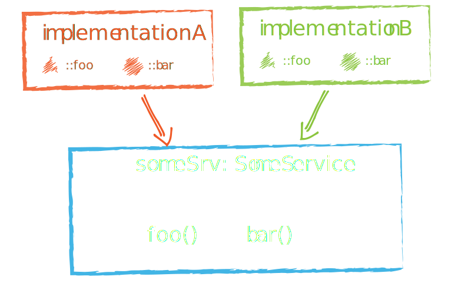

<style>
  @font-face {
    font-family: Text;
    src: url("./fonts/Text.ttf");
  }
  @font-face {
    font-family: Header;
    src: url("./fonts/Header.ttf");
  }
  @font-face {
    font-family: Code;
    src: url("./fonts/Code.ttf");
  }
  .reveal {
    font-family: Text !important;
  }
  .reveal h1,
  .reveal h2,
  .reveal h3,
  .reveal h4,
  .reveal h5,
  .reveal h5 {font-family: Header !important;}

  .reveal h1 {
    font-size: 3em;
  }

  .reveal code,
  .reveal pre {font-family: Code !important;}

  .reveal section img {
    border: none;
    outline: none;
    box-shadow: none;
    background-color: transparent;
  }
</style>


---
# How to Angular for A+

---
## Core ideas
--
### Components

--
### Abstract component


--
- Component Logic
- Template
- Scoped Styles

--
### Angular component


--
### Unidirectional Data flow


--
### Dependency Injection

--

### Web Components Similarity


---
## Angular guts

--
### Angular modules


--
```js
import { NgModule } from '@angular/core';

import { SomeComponent } from './some.component';
import { SomeDirective } from './some.directive';
import { SomePipe } from './some.pipe';

@NgModule({
  declarations: [SomeComponent, SomeDirective, SomePipe],
  providers: [SomeService],
  exports: [SomeComponent, SomeDirective, SomePipe]
})
export class SomeModule {}
```

--
#### "DECLARATIONS" property
Is for things you’ll use in your templates: components, directives, pipes

#### "PROVIDERS" property
Is for services

#### "EXPORTS" property
Exposes listed items so you can import them in other modules

--
Declarations (components, directives, pipes) are in **local** scope

--
Providers (services) are in **global** scope

--
#### Feature module

- **Do not** import `BrowserModule`
- Always **export** stuff
- **Do not mix** component/pipes/directives and services
- **Do not user** browser-specific API **directly**

--
#### Lazy loading

Load view as separate module **only** is it was navigated to.

--
### Dependency Injection in details
--

#### "provide" and "use*"

```js
...
providers: [{
  provide: SomeService,
  useClass: SomeOtherService
}]
...
```
```js
...
providers: [{
  provide: SomeService,
  useValue: {
    method() {...}
  }
}]
...
```
--
### NgZone

--
#### zone.js zones

Closed environments that let you monitor, control, and react to all events, from asynchronous tasks to errors thrown

--
in simple words — hooks to all async operations

--
#### zones in angular

- uses zone to be aware of **possible** data changes
- `runOutsideAngular` allows to run code without change detection

--
### Change Detection mechanism

--
#### Can be triggered by:
- **Events** - click, submit, etc.
- **XHR** - Fetching data from a remote server
- **Timers** - setTimeout(), setInterval()

--
#### Why?

ngZone

--
#### Each component has its own change detector
--
#### And components are building their own change detector trees

--
#### Change detection strategies
- Default
- OnPush

--
#### ChangeDetectionStrategy.Default

Performs from root component to each branch.

Slightest data change in **any** components triggers data check for **entire** tree.

--
#### Tickle one, fire all


--
#### ChangeDetectionStrategy.OnPush
Turn off change default detection for component.

--
#### OnPush & immutable data
Triggers only if **@Input** property value was changed entirely, by reference

--
#### Push me. And then just touch me


--
#### OnPush & Observable

- Uses stream for passing new data;
- Using `ChangeDetectorRef::markForCheck()` allows us to manually mark components subtree for check;

--
### Component with observable input

```js
import { ... } from '@angular/core';
@Component({
  changeDetection: ChangeDetectionStrategy.OnPush
})
export class CounterComponent {
  constructor(private cd: ChangeDetectorRef) {}
  @Input() data: Observable<any>;
  ngOnInit() {
    this.data.subscribe(value => {
      this._data = value;
      this.cd.markForCheck(); // tell CD to verify this subtree
    });
  }
}
```
--
#### Observe and protect!


--
## RxJS & Observables
Library for transforming, composing, and querying streams of data. We mean all kinds of data too, from simple arrays of values, to series of events (unfortunate or otherwise), to complex flows of data.

---
```js
class MyComponent {
  constructor(private stuff: MostOfAngularStuff) {
    this.stuff.subscribe(stuff => console.log(stuff));
  }
}
```

---
### Observable


--
## NGRX

--
### Store
```js
const ACTION = '[Store] Action';
class DoAction {
  readonly type = ACTION;
  constructor(public payload: SomeType) { }
}

export function reducer(state: {}, { type, payload }) {
  switch (type) {
    ...
    case ACTION:
      return { ...state, { property: payload }
    ...
  }
}
```
--
### USing in component
```js
@Component(...)
class ViewComponent {
  property: Observable<string>;
  constructor(private store: Store<any>) {
    const state = this.store.select('reducer');
    this.property = state.select('property');
  }
}
```
--
### Effects
```js
@Injectable()
class StateEffects {
  constructor(private actions: Actions, private srv: Service) {}
  @Effect()
  action: this.actions
    .ofType(ACTION)
    .switchMap(action => this.srv.doMagic(action))
    .map(response => new ChangeData(response))
}
```
---
## Looking forward
---
### New features
- Ivy Renderer
- New Compilers
- Service Worker Improvements
- Component tree-shaking
- Component Dev Kit (CDK)
- Typescript 2.6.x support

### And more
